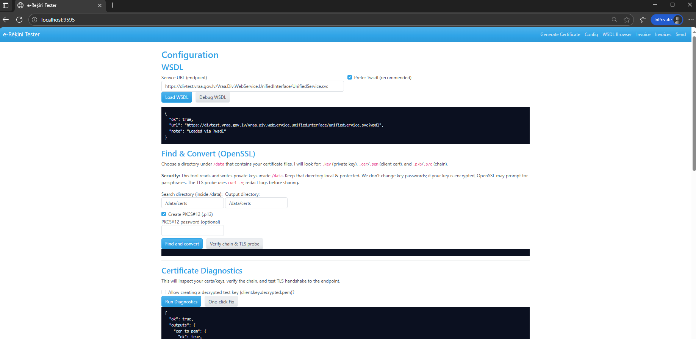

# e-Rēķini Tester



A reference to official guidelines for integrating e-invoices with the Latvija.lv governmental portal can be found in the [e-adrese guidelines](https://viss.gov.lv/lv/Informacijai/Dokumentacija/Vadlinijas/e-adrese).

A minimal **FastAPI** web application to **edit**, **validate**, and **send** e-invoices via **SOAP** with **WS-Security UsernameToken (digest)** and optional **mutual TLS**.

This tool is intended as a **local integration tester** for the Latvian VDAA *e-Rēķini* system.  
It helps integrators, developers, and support teams validate invoice XMLs, test SOAP connectivity, and debug certificate/TLS issues before wiring production systems.

---

## Features

- **Configuration UI** for:
  - Endpoint
  - SOAPAction
  - Username/Password
  - TLS settings
  - Client certificate paths
  - XSD entry path
  - Success indicator (substring check in response)

- **Invoice editor**:
  - Load, edit, and save XML invoices
  - Preloaded with sample invoice XML

- **Schema validation**:
  - XSD validation with `lxml`
  - Supports UBL 2.1 tree and LV profile schemas

- **SOAP client**:
  - Builds WS-Security UsernameToken (digest)
  - Optional mutual TLS with PEM keypair
  - PKCS#12 supported via manual conversion to PEM/KEY
- **WSDL browser**:
  - Fetches available SOAP operations after authentication
  - Clicking an operation fills SOAPAction and seeds the invoice body

- **Debug panel**:
  - Shows raw SOAP request & response
  - HTTP headers and status
  - TLS info and timings
  - Saves last request/response to `/data/logs/`

- **Persistence**:
  - Config and logs persisted under `/data` for easy Docker volume mounting

---

## Repository Layout

```
app/                # FastAPI application
  main.py
  soap_client.py
  validation.py
  storage.py
  templates/
  static/
data/
  samples/          # sample invoice XMLs (e.g. einvoice_reference.xml)
  xsd/              # place UBL XSD tree here (entry: UBL-Invoice-2.1.xsd)
  certs/            # client certificates (PEM/KEY or PKCS#12 converted)
  trust/            # custom CA bundle (optional)
  invoices/         # generated invoices
  logs/             # saved request/response logs
docker/
  Dockerfile
docker-compose.yml
.env.example
README.md
```

---

## Running with Docker

1. Copy the environment file:

   ```bash
   cp .env.example .env
   ```

2. Build and run the container:

   The compose file uses the project root as the build context and points to `docker/Dockerfile`:

   ```yaml
   build:
     context: .
     dockerfile: docker/Dockerfile
   ```

   Run the container:

   ```bash
   docker compose up --build
   ```

3. Open the application:

   ```
   http://localhost:9595
   ```

---

## Running Bare Metal

1. Install dependencies:

   ```bash
   pip install fastapi uvicorn jinja2 requests lxml python-dotenv python-multipart
   ```

2. Export environment variables:

   ```bash
   export DEFAULT_INVOICE=/path/to/data/samples/einvoice_reference.xml
   export DEFAULT_SCHEMA=/path/to/data/xsd/UBL-Invoice-2.1.xsd
   ```

3. Start the app:

   ```bash
   uvicorn app.main:app --reload --port 9595
   ```

---

## Certificates

- **Mutual TLS (recommended)**:  
  Place `client.pem` and `client.key` under `data/certs/` and reference their paths in the Config screen.

- **PKCS#12 (P12/PFX)**:  
  Convert to PEM/KEY with OpenSSL before use:

  ```bash
  openssl pkcs12 -in client.p12 -clcerts -nokeys -out client.pem
  openssl pkcs12 -in client.p12 -nocerts -nodes -out client.key
  ```

- **Custom CA bundles**:
  If the endpoint uses a private CA, place it under `data/trust/ca.pem` and set the path in Config.

## Generate Certificate (Key + CSR)

Use the **Generate Certificate** tab to create your private key and certificate signing request:

1. Open **Generate Certificate** (first tab).
2. Fill Subject (DN) fields (C, ST, L, O, OU, CN, email).
3. (Optional) Enter a key passphrase.  \
   - If you use a passphrase, the key will be encrypted (AES-256) and you must provide this passphrase later in Config (for the TLS probe and sending).
4. Click **Generate Key & CSR**.

The app writes files to `/data/certs/`:
- `client.key` (or `{base}.key`) — your private key, **keep it safe**.
- `client.csr` (or `{base}.csr`) — send this to **VDAA** for issuance.

**After issuance**
- VDAA returns `client.cer` (your cert) and optionally `chain.p7b` (CA chain).
- Go to **Config → Find & Convert**, choose `/data/certs` and click **Find and convert**.  \
  This will produce:
  - `client.pem`, `chain.pem`, `client_full.pem` (cert + chain)
- Ensure **Config** paths:
  - Client cert (PEM): `/data/certs/client_full.pem`
  - Client key (PEM):  `/data/certs/client.key`
  - CA bundle:         `/data/certs/chain.pem`
- Click **Verify chain & TLS probe** to confirm connectivity.

> Requirements (per VDAA/VISS guidance):
> - RSA **2048-bit** key
> - SHA-256 for CSR
> - Keep the **private key** private. Do not email/upload it.

## Find & Convert (OpenSSL)

The Config screen now offers a **Find & Convert** panel. It scans a directory under `/data` for a private key (`*.key`), client certificate (`*.cer`/`*.crt`/`*.pem`), and chain file (`*.p7b`/`*.p7c`). The tool assembles `client.pem`, `chain.pem`, `client_full.pem`, and optionally `client.p12`, then applies these paths to the configuration.

**Security notes**

- Reads and writes private keys inside `/data`; keep this directory local and protected.
- Key passwords are untouched. If your key is encrypted, OpenSSL may prompt for its passphrase.
- The TLS probe uses `curl -v` and prints the handshake log. Redact sensitive data before sharing.

**Typical flow**

1. Place raw files in `/data/certs` (`client.key`, `client.cer`, `chain.p7b`).
2. Open **Config → Find & Convert**.
3. Adjust directories if needed and run **Find and convert** (enable PKCS#12 to create `client.p12`).
4. Run **Verify chain & TLS probe** to check the assembled certificates.

---

### WSDL Browser

Use **WSDL Browser** to discover operations and auto-fill the Send page.

1. Open **WSDL Browser** tab.
2. Click **Load & List Operations** (uses `?wsdl` first; falls back to `?singleWsdl`).
3. Filter or scroll the list; click **Use in Send** on an operation.
   - This sets **SOAPAction** in Config and prepares a **SOAP 1.2** envelope with a minimal body template.
   - You are taken to **Send**, where the request body is prefilled. Replace `<value>` placeholders with actual data.
4. If there are issues, the **Config → WSDL → Debug WSDL** panel can diagnose TLS/URL/format problems.

> Notes:
> - For WSDL fetching, the app uses the **system CA** (public trust) and still presents your **client cert/key** for mTLS.
> - Do **not** point the CA bundle to your **client chain** when loading WSDL (see “Known Issue”).

---

## Usage Workflow

1. **Open Config tab**
   - Enter endpoint, credentials, and cert paths
   - Use **Load WSDL** to list available operations; selecting one fills `SOAPAction` and seeds a minimal request body
   - Save configuration

2. **Load Invoice**  
   - Load sample invoice from `/data/samples/` or paste your own XML  
   - Edit and save as needed

3. **Validate Schema**  
   - Run XSD validation against UBL 2.1 tree  
   - Resolve all errors before sending

4. **Send Invoice**  
   - Build SOAP envelope with WS-Security UsernameToken  
   - Send via HTTPS with optional mutual TLS  
   - Inspect raw request/response in Debug panel

5. **Check Logs**  
   - Last request/response stored in `/data/logs/last-request.xml` and `/data/logs/last-response.xml`

---

## Notes

- Ensure the **UBL XSD tree** is placed under `data/xsd/` so relative imports resolve.
- The app checks “success” by:
  - HTTP status = `200` **and**
  - Response contains the configured *Success indicator* substring (default: `"Valid"`).
- This is a **test tool only**, not for production invoice dispatch.

## Known Issue: CA bundle vs. public trust (WSDL fetch)

When fetching the WSDL from the DIV test endpoint (`*.vraa.gov.lv`), **do not** set the app's **CA bundle** to your **client certificate chain** (e.g., `/data/certs/chain.pem`). That file is the **client chain for mTLS**, not a public trust store. If you point HTTP verification at it, requests/zeep may fail with:

```
requests.exceptions.SSLError: CERTIFICATE_VERIFY_FAILED: self-signed certificate in certificate chain
```

**Solution:** For WSDL loading, the app uses the **system CA store** (public roots) and still presents your client certificate for mTLS. Leave the **CA bundle** field empty for public endpoints like `*.vraa.gov.lv`.

---

## WSDL loading (WCF)

The DIV WCF service exposes two WSDL endpoints:

- `?wsdl` (**multi-document**, recommended) — Zeep downloads `?xsd=xsd0`, `?xsd=xsd1`, … with proper `schemaLocation`.
- `?singleWsdl` (**single file**) — may include `<xs:include/>` **without** `schemaLocation`, which Zeep rejects with:

```
NotImplementedError: schemaLocation is required
```

If you see this error, use **`?wsdl`**.

The app’s **Load WSDL** button defaults to **prefer ?wsdl** and uses **system CAs** for verification while keeping **mTLS** with your client cert/key.

---

## Troubleshooting WSDL

Open **Config → WSDL → Debug WSDL**. The tool will:

- Try both `?wsdl` and `?singleWsdl`
- Use system CA trust + mTLS (works with encrypted keys)
- Fall back to `curl` (captures raw headers/body)
- Show status, content-type, a preview, and parse notes
- Provide suggestions:

Common hints:
- **HTML 200 help page** → You hit the service URL, not the WSDL; use `?wsdl` or `?singleWsdl`.
- **401/403** → Client certificate not authorized in this environment.
- **certificate verify failed** → Do not set CA bundle to your client chain for WSDL; use system CA.
- **schemaLocation is required** → WCF `?singleWsdl` quirk; switch to `?wsdl`.

When WSDL loads, you can inspect it under `/data/wsdl/` or import into SoapUI to discover operations/actions.

---

## WSDL Service Discovery

The app now includes a full WSDL discovery workflow so integrators can inspect services/ports/operations, generate request body templates, and auto-fill the Send page with the correct SOAPAction and a SOAP 1.2 envelope.

### What's included

**Config → WSDL**

- **Load WSDL**: fetches and validates the contract (prefers `?wsdl`).
- **Debug WSDL**: diagnostic run (tries `?wsdl` and `?singleWsdl`, shows HTTP status/headers/preview, mTLS on system CA trust).

**WSDL Browser tab**

Lists Service → Port → Operation with:

- Operation name
- SOAPAction
- Namespace (derived from the operation input type)
- Human-readable input signature
- **Use in Send**: writes SOAPAction to Config, defaults SOAP 1.2, and pre-fills the Send editor with a minimal body template.

Saved WSDLs and temp artifacts are under `/data/wsdl/`.

### How to use

1. Verify TLS in Config (your client cert/key are required).
2. In **Config → WSDL**, press **Load WSDL**.  
   You should see `{ "ok": true, "note": "Loaded via ?wsdl" }`.
3. Open the **WSDL Browser** tab:
   - Enter/confirm the Service URL (the base `.svc` URL).
   - Click **Load & List Operations**.
   - Filter or scroll, then click **Use in Send** on the operation you need (e.g., `SendMessage`).
4. You'll be taken to **Send**:
   - SOAP version is **1.2** by default (adjust if needed).
   - WS-Addressing is recommended for WCF services.
   - The body editor is pre-filled with a minimal XML template; replace `<value>` placeholders with real data.
5. Send the request. For messaging flows, capture `MessageId` from the response, then call `GetMessageServerConfirmation` to verify server acceptance.

### Common DIV operations (examples)

| Operation                | Purpose                                      | Typical Inputs (simplified)                                  |
|--------------------------|----------------------------------------------|--------------------------------------------------------------|
| `SendMessage`            | Single-shot send (envelope + optional attachment) | `Envelope`, `AttachmentsInput[]`                             |
| `InitSendMessage`        | Start chunked send                           | `MessageClientId`, `SenderEAddress`, `AttachmentsInput[]`    |
| `SendAttachmentSection`  | Upload chunk                                 | `MessageId`, `ContentId`, `SectionIndex`, `Contents(base64)` |
| `CompleteSendMessage`    | Finish chunked send                          | `MessageId`, `Envelope`                                      |
| `GetMessageServerConfirmation` | Check server acceptance                | `MessageId`                                                  |
| `ConfirmMessage`         | Confirm receipt                              | `RecipientConfirmationPart`, `MessageId`                     |
| `GetMessage`             | Fetch a message                              | `MessageId`                                                  |
| `GetAttachmentSection`   | Fetch attachment chunk                       | `MessageId`, `ContentId`, `SectionIndex`                     |

The WSDL Browser shows the precise SOAPAction and the operation’s input signature pulled directly from the service.

### Example (SOAP 1.2 + WS-Addressing)

The **Use in Send** button generates a skeleton similar to this (you only fill in values):

```xml
<soap:Envelope xmlns:soap="http://www.w3.org/2003/05/soap-envelope"
               xmlns:wsa="http://www.w3.org/2005/08/addressing">
  <soap:Header>
    <wsa:Action>http://vraa.gov.lv/div/uui/2011/11/UnifiedServiceInterface/SendMessage</wsa:Action>
    <wsa:To>https://divtest.vraa.gov.lv/Vraa.Div.WebService.UnifiedInterface/UnifiedService.svc</wsa:To>
    <wsa:MessageID>urn:uuid:REPLACEME</wsa:MessageID>
  </soap:Header>
  <soap:Body>
    <!-- Operation body generated from WSDL; replace <value> placeholders -->
    <!-- Example structure (actual elements may differ per schema): -->
    <tns:SendMessage xmlns:tns="http://vraa.gov.lv/xmlschemas/div/uui/2011/11">
      <tns:Envelope>…</tns:Envelope>
      <tns:AttachmentsInput>
        <AttachmentInput>
          <ContentId>REPLACEME</ContentId>
          <FileName>invoice.xml</FileName>
          <MimeType>application/xml</MimeType>
          <Contents>BASE64…</Contents>
        </AttachmentInput>
      </tns:AttachmentsInput>
    </tns:SendMessage>
  </soap:Body>
</soap:Envelope>
```

The sender automatically uses `Content-Type: application/soap+xml; action="…"` for SOAP 1.2.

### Troubleshooting WSDL

Use **Debug WSDL** in **Config → WSDL** if listing operations fails:

- Tries `?wsdl` and `?singleWsdl`.
- Shows HTTP status/headers/body preview, parse notes, and suggestions.
- **WCF quirk:** `?singleWsdl` may include `<xs:include/>` without `schemaLocation`, which some parsers reject. Prefer `?wsdl`.
- **Trust store note:** For WSDL fetching the app uses the system CA store with mTLS.  
  Do not point the CA bundle to your client chain file; that can cause:

```
CERTIFICATE_VERIFY_FAILED: self-signed certificate in certificate chain
```

## Invoice Editor & XSD Validation

Open **Invoice** tab to edit, generate, and validate a UBL 2.1 invoice.

- The form is **prefilled** from a reference XML (default: `/data/samples/einvoice_reference.xml`).
- Click **Generate XML** to preview, or **Generate & Save** to write into `/data/invoices/`.
- Choose an **XSD entrypoint** (e.g. `data/xsd/maindoc/UBL-Invoice-2.1.xsd`) and click **Validate**.
- See all saved invoices in the **Invoices** tab; download them as needed.

### Schemas

This tester uses **OASIS UBL 2.1** schemas (authoritative XML schema for invoices).  
Fetch the full UBL 2.1 XSD set:

```bash
python tools/fetch_schemas.py
# XSDs will be placed under data/xsd/
```

Why UBL 2.1?
Latvia’s e-rēķins follows EN 16931 (EU e-invoicing standard) and commonly uses the UBL binding. For legal basis in public procurement, see MK Noteikumi Nr. 154 (which references the European standard).

## Business-Rule Validation (Schematron)

**What is Schematron?**  
Schematron is a rule language for XML that uses XPath assertions to validate **business rules** (beyond structural XSD checks). The EN 16931 and Peppol BIS 3.0 e-invoicing rules are distributed as Schematron (often compiled to XSLT that produces an **SVRL** report).

**Engine**  
This app runs compiled Schematron XSLT using **Saxon-HE** (Java) and parses the **SVRL** output to list failures/warnings.

**Setup**  
1. Ensure Java is present inside the container. The Dockerfile installs `openjdk-17-jre-headless` and downloads `saxon-he.jar` to `/opt/saxon/saxon-he.jar`.  
2. Place compiled rules under:


```
data/schematron/en16931/.xslt
data/schematron/peppol/.xslt
```

*(If you only have `.sch`, add the ISO Schematron compilation step to generate XSLT, or provide precompiled XSLT from the rule provider.)*

**Usage**  
- Open **Invoice** tab, generate or load invoice, then:
- Run **Validate XML** (XSD) for structural compliance.
- Choose a **Schematron ruleset** and click **Validate (Schematron)** for business-rule compliance.
- Results appear as a list and are available in **SVRL** form for audit under the debug panel.

**Notes**
- XSD ≠ business rules. For full compliance you need **both** XSD and Schematron.
- Many EN/Peppol rules use **XPath 2.0**, hence the use of Saxon-HE. Python `lxml`’s built-in Schematron (XPath 1.0) is insufficient for those rule sets.

---

## License

This project is licensed for non-commercial use only. Commercial use requires a separate license. See [LICENSE](LICENSE).

